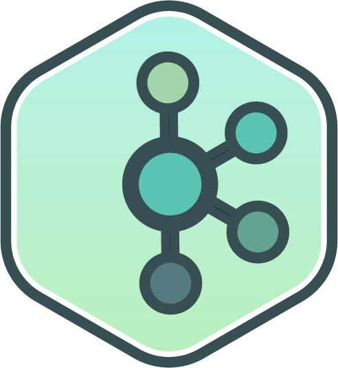

<!-- PROJECT SHIELDS -->

<!-- PROJECT LOGO -->
<br />
<p align="center">
  <a href="https://github.com/pvyas033/event-driven-microservices">
    
  </a>

  <h3 align="center">Event-Driven-Architecture</h3>

  <p align="center">
    <br />
    <a href="https://github.com/pvyas033/event-driven-microservices"><strong>Explore the docs »</strong></a>
    <br />
    <br />
    <a href="https://github.com/pvyas033/event-driven-microservices">View Demo</a>
    ·
    <a href="https://github.com/pvyas033/event-driven-microservices/issues">Report Bug</a>
    ·
    <a href="https://github.com/pvyas033/event-driven-microservices/issues">Request Feature</a>
  </p>
 </p>


<!-- TABLE OF CONTENTS -->
<details open="open">
  <summary>Table of Contents</summary>
  <ol>
    <li>
      <a href="#about-the-project">About The Project</a>
      <ul>
        <li><a href="#built-with">Built With</a></li>
      </ul>
    </li>
    <li>
      <a href="#getting-started">Getting Started</a>
      <ul>
        <li><a href="#prerequisites">Prerequisites</a></li>
        <li><a href="#installation">Installation</a></li>
      </ul>
    </li>
    <li><a href="#usage">Usage</a></li>
    <li><a href="#roadmap">Roadmap</a></li>
    <li><a href="#contributing">Contributing</a></li>
    <li><a href="#license">License</a></li>
    <li><a href="#contact">Contact</a></li>
    <li><a href="#acknowledgements">Acknowledgements</a></li>
  </ol>
</details>


<!-- ABOUT THE PROJECT -->
## About The Project

Event-Driven Microservices Architecture with patterns using Spring boot, Spring cloud, Kafka and Elasticsearch


### Prerequisites

- Knowledge of Java
- Basic knowledge of Spring Framework
- Basic knowledge of Maven 
- Back-end development experience
- Docker experience
- Twitter Developer Account (If you are using twitter data for stream)

<!-- GETTING STARTED -->

## Getting Started

- Please enter the correct credentials in twitter4j.properties file.
- Then run 
  ```sh
  mvn install -DskipTests 
  ```
- Then go to \docker-compose folder and run below command to run kafka cluster and twitter-to-kafka-service together 
  ```sh
  docker-compose up 
  ```


### Installation

1. Clone the repo
   ```sh
   git clone https://github.com/pvyas033/event-driven-microservices.git
   ```
2. You can use any IDE(intellij or vs code) 

<!-- USAGE EXAMPLES -->
## Usage


For further reference, please consider the following sections:

* [Official Apache Maven documentation](https://maven.apache.org/guides/index.html)
* [Spring Boot Maven Plugin Reference Guide](https://docs.spring.io/spring-boot/docs/2.5.6/maven-plugin/reference/html/)
* [Create an OCI image](https://docs.spring.io/spring-boot/docs/2.5.6/maven-plugin/reference/html/#build-image)


<!-- ROADMAP -->
## Roadmap

See the [open issues](https://github.com/pvyas033/event-driven-microservices/issues) for a list of proposed features (and known issues).


<!-- CONTRIBUTING -->
## Contributing

Contributions are what make the open source community such an amazing place to be learn, inspire, and create. Any contributions you make are **greatly appreciated**.

1. Fork the Project
2. Create your Feature Branch (`git checkout -b feature/AmazingFeature`)
3. Commit your Changes (`git commit -m 'Add some AmazingFeature'`)
4. Push to the Branch (`git push origin feature/AmazingFeature`)
5. Open a Pull Request


<!-- CONTACT -->
## Contact

Pankaj Vyas | [Website](https://pankajvyas.in/#/) | [LinkedIn](https://www.linkedin.com/in/pankaj033/) | [Twitter](https://twitter.com/pankaj_pvt) | pankajvyas033@gmail.com

Project Link: [https://github.com/pvyas033/event-driven-microservices](https://github.com/pvyas033/event-driven-microservices)


<!-- ACKNOWLEDGEMENTS -->
## Acknowledgements
* [Official Apache Maven documentation](https://maven.apache.org/guides/index.html)
* [Spring Boot Maven Plugin Reference Guide](https://docs.spring.io/spring-boot/docs/2.5.6/maven-plugin/reference/html/)
* [Create an OCI image](https://docs.spring.io/spring-boot/docs/2.5.6/maven-plugin/reference/html/#build-image)


